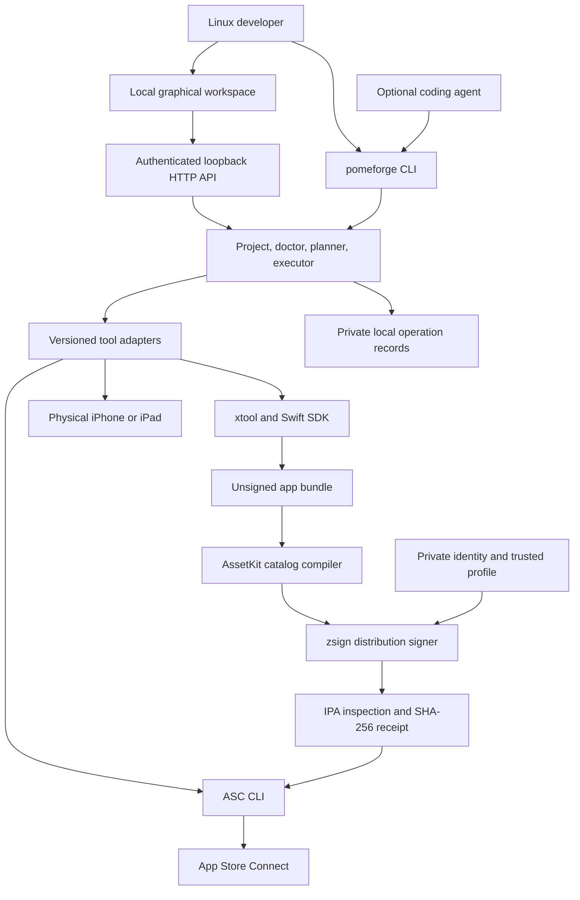

# Pomeforge architecture

Pomeforge is a Linux workspace for developing Swift iPhone and iPad apps. A person can use the graphical app or CLI. An agent uses the same CLI with JSON output. AI is optional and never required to create, build, test, or release an app.

The first supported project format is xtool's Swift Package Manager application. Arbitrary Xcode projects, React Native, Flutter, simulator execution, Interface Builder, and Xcode-specific plugins are outside this initial compatibility claim. Supporting those requires separate adapters and evidence.

## Product contract

The intended primary path runs entirely on Linux, including SDK extraction, cross-compilation, signing, physical-device installation, IPA upload, and review submission. Every build step must execute on Linux. Hosted macOS, remote Xcode, and Apple-hardware build services are excluded, including as optional fallbacks.

Technical feasibility is separate from Apple's SDK license, Developer Program enrollment, account access, signing permissions, app eligibility, and App Review approval. Pomeforge cannot grant those. It will link the applicable upstream requirements and stop at missing prerequisites.

## Components

Use Go with its standard library for a small self-contained executable, Linux amd64 and arm64 builds, subprocess control, HTTP, and embedded assets. Two pinned parsing dependencies handle Apple XML/binary plists and CMS signatures. The asset compiler is a separate Swift executable using pinned AssetKit source. The initial graphical app is a local browser workspace with a Linux desktop launcher. A packaged native window can reuse that workspace later. It is not an editor, iOS simulator, or browser-based rendering of an iOS application.

The CLI and HTTP API call the same Go services. There is no frontend-only fake build path. Each operation starts as a plan containing a stable ID, executable and argv, working directory, prerequisites, effect class, warnings, and whether confirmation is required. The executor accepts only known operations, reconstructs plans from validated project data, detects stale inputs, uses argument arrays without a shell, and records exit status. App Store writes require explicit confirmation. Build hooks and package plugins can execute project code, so builds are explicit user actions.

## Project and state

`pomeforge.json` contains schema version, display name, bundle identifier, supported device families, minimum iOS version, marketing version, build number, and optional App Store app/version/build IDs. It contains no credentials. The project also includes `Package.swift`, `xtool.yml`, an actual SwiftUI application, and release guidance. iPhone and iPad support must appear in the emitted bundle configuration.

Private operation results live under `.pomeforge/`, ignored by Git. Tool metadata uses XDG configuration/data/cache locations on Linux. SDK files, signing identities, provisioning profiles, API private keys, and paired device records stay outside version control. Child processes inherit only the environment needed by the selected adapter; diagnostics and retained output must not dump credentials.

## Dependency onboarding

Detect installed xtool, Swift, ASC CLI, and USB tooling. Distinguish missing, incompatible, available, and unverified. Provide current upstream installation instructions. Prefer pinned release downloads with published SHA-256 verification, staging, executable checks, atomic activation, rollback, and no root requirement. Never pipe remote shell scripts into a shell. Automatic SDK downloads must respect upstream authentication and license interactions. Do not claim every distribution is verified merely because a Go binary runs there.

Omarchy/Arch is a first-class target. Portable Linux binaries are the common base; package-manager hints are advisory and never silently execute sudo. A compatibility matrix separately tracks glibc distributions, musl/Alpine, x86_64, arm64, FUSE/AppImage needs, usbmuxd, udev permissions, and connected-device versions.

## Human and agent interaction

Humans get a project list, create form, prerequisite diagnosis, inspectable operation plans, and a result log. Agents get a discoverable schema, JSON success/error envelopes, deterministic exit codes, noninteractive defaults, and explicit execution/confirmation flags. No operation silently invokes a language model. High-impact work is never performed merely by opening the app, running doctor, or viewing a plan.

The API binds only to loopback, rejects foreign Host and Origin headers, requires a random session token for API calls, imposes request limits and timeouts, and accepts project paths confined to its workspace. The UI does not load third-party scripts or fonts. Escape all project names and subprocess output as text. Never accept an arbitrary command from a browser or agent.

## Verification boundary

Unit tests and subprocess fixtures establish Pomeforge's behavior. Linux execution establishes portability only for the tested architecture and environment. A real iOS build, on-device launch, signing validation, TestFlight processing, and App Store submission are separate gates. Do not label any of those complete based on a successful mock or process spawn.

Current upstream evidence and adapter commands are recorded in `docs/toolchain-research.md` after verification.

[Linux toolchain decisions](linux-toolchain-decisions.md) explains the SDK installation, provenance, linker, asset and archive corrections established by actual Linux probes.
